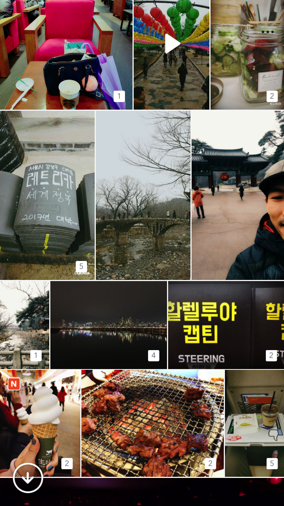
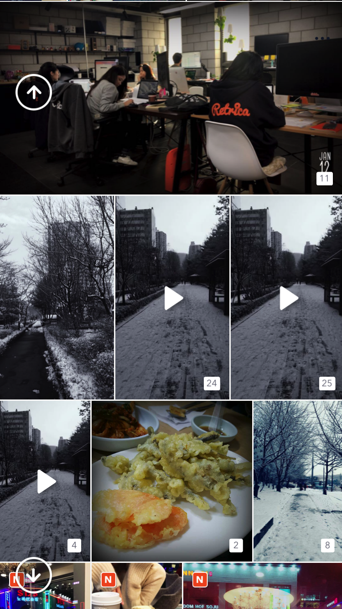

# IrregularCollectionUIKit

[](https://travis-ci.org/pisces/IrregularCollectionUIKit)
[](http://cocoapods.org/pods/IrregularCollectionUIKit)
[](http://cocoapods.org/pods/IrregularCollectionUIKit)
[](http://cocoapods.org/pods/IrregularCollectionUIKit)

## Example

To run the example project, clone the repo, and run `pod install` from the Example directory first.

## You can implement layout of collection view like this screenshot :)
<p valign="top">


</p>

### To implement collection view with the class ASIrregularCollectionViewController using Facebook AsyncDisplayKit
```Swift
class ASExampleCollectionViewController: ASIrregularCollectionViewController {
    
    override func viewDidLoad() {
        super.viewDidLoad()
        
        self.collectionViewLayout.columnSpacing = 1.4
        self.collectionViewLayout.numberOfColumns = 3
        self.collectionViewLayout.headerHeight = 0
        self.collectionViewLayout.footerHeight = 0
        
        self.collectionView.allowsMultipleSelection = true
        self.collectionView.alwaysBounceVertical = true
        
        self.collectionView.tuningParameters(for: .visibleOnly, rangeType: .fetchData)
    }
}
```

### To implement collection view with the class IrregularCollectionViewController using UIKit
```Swift
class ExampleCollectionViewController: IrregularCollectionViewController {
    
    override func viewDidLoad() {
        super.viewDidLoad()
        
        self.collectionViewLayout.columnSpacing = 1.4
        self.collectionViewLayout.numberOfColumns = 3
        self.collectionViewLayout.headerHeight = 0
        self.collectionViewLayout.footerHeight = 0
        
        self.collectionView.allowsMultipleSelection = true
        self.collectionView.alwaysBounceVertical = true
    }
}
```

## Requirements

## Installation

IrregularCollectionUIKit is available through [CocoaPods](http://cocoapods.org). To install
it, simply add the following line to your Podfile:

```ruby
pod "IrregularCollectionUIKit"
```

## Author

Steve Kim, pisces@retrica.co

## License

IrregularCollectionUIKit is available under the MIT license. See the LICENSE file for more info.
